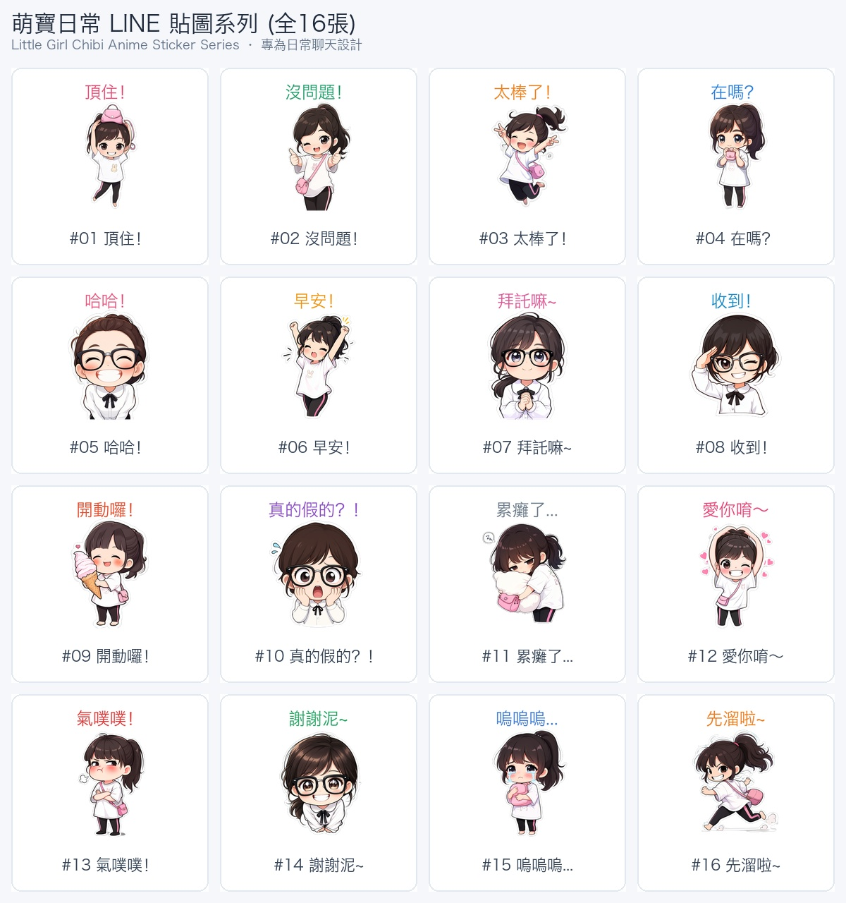
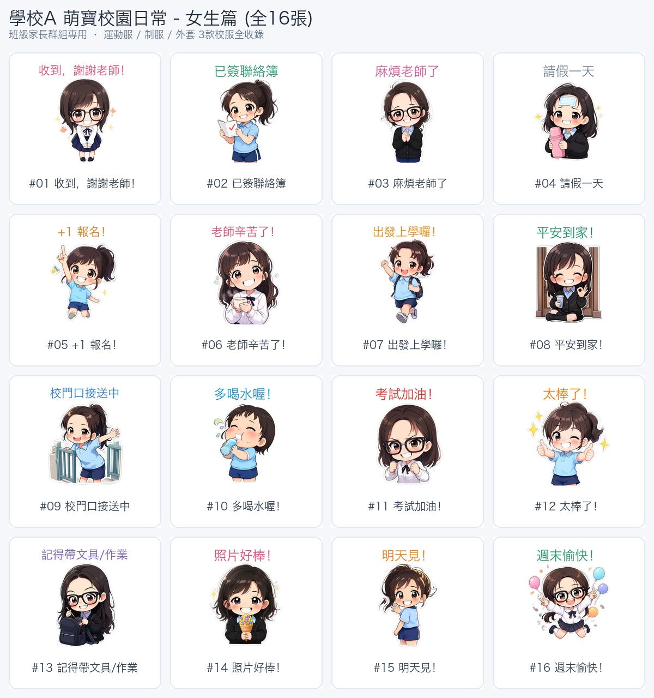
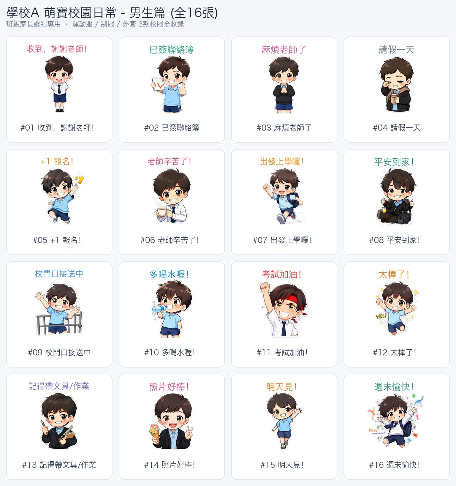
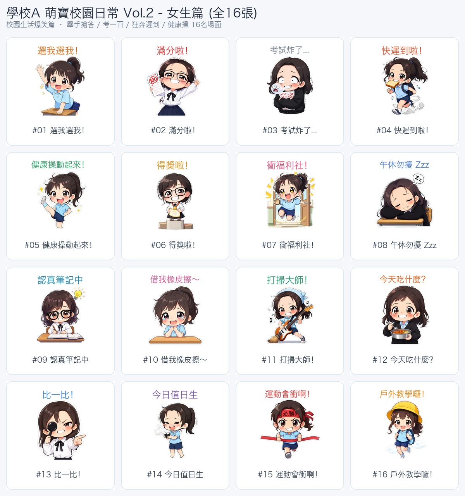
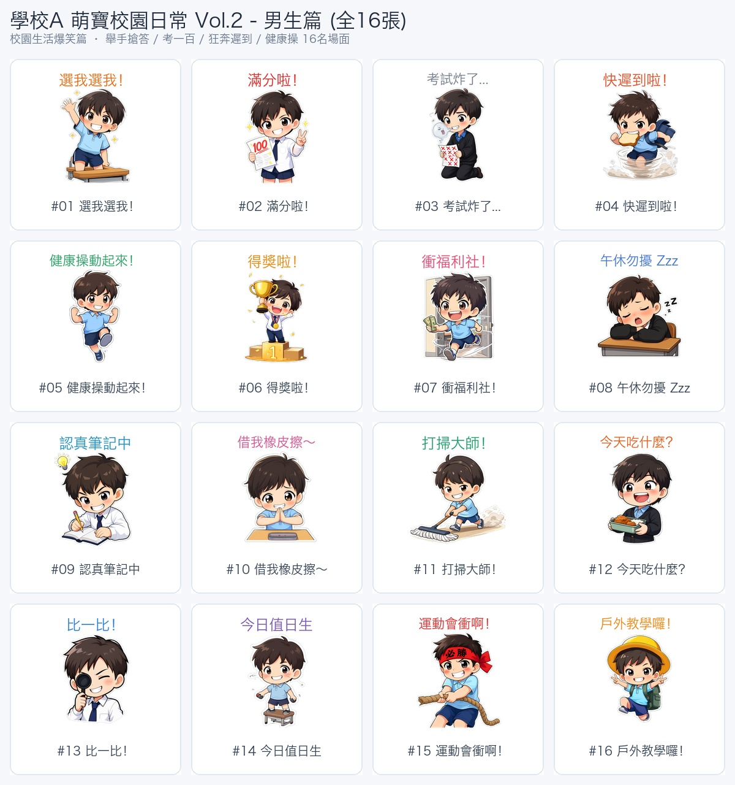
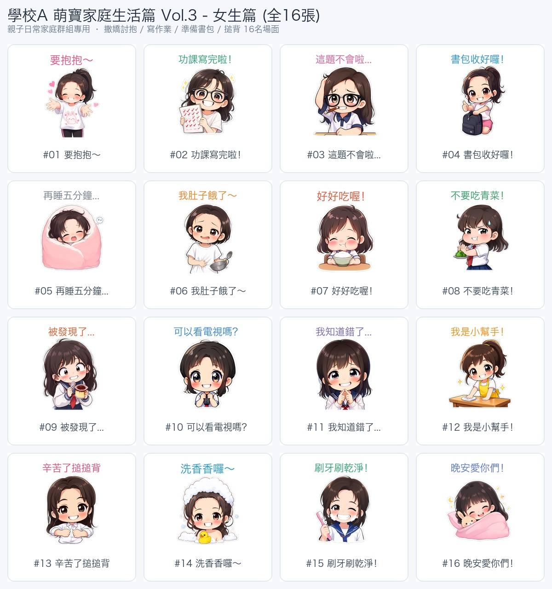
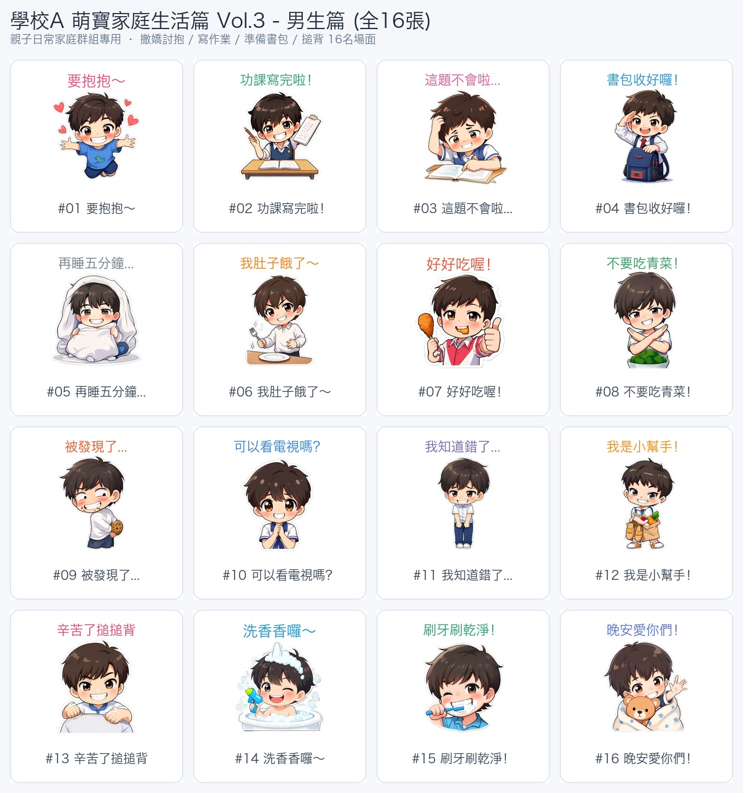

# 🎨 Official Character Copyright & Originality Registry
### LINE Creators Market 作品證明與原創著作權官方存證庫

[](https://github.com/fableguo)
[-green.svg)](./LICENSE)
[](https://creator.line.me/)
[]()

---

## 📌 Executive Statement for LINE Reviewers (LINE 審核團隊聲明)

> **Official Declaration regarding LINE Creators Market Review Guidelines (Sections 1.1 & 5.1)**:
> 
> This public GitHub repository serves as the **official, authoritative portfolio and proof of copyright ownership (作品確認・著作権証明)** for all LINE sticker packages submitted by creator **fableguo**.

### 1. Guideline 1.1 Compliance (No Fan Fiction / Clear Ownership)
* **English**: All characters depicted in these sticker collections (including **Chen-Chen / 晨晨** and **An-An / 安安**) are **100% original fictional characters** developed and designed exclusively by **fableguo**. They are **NOT fan fiction**, **NOT secondary creations (二次創作)**, and **NOT parody/derivative works** of any existing franchise, manga, anime, video game, or public figure.
* **繁體中文**: 本代碼庫收錄之全系列貼圖角色（女主角「晨晨」、男主角「安安」）均為創作者 **fableguo** 獨立原創設計之虛擬角色。本作品**絕非任何現有動漫、影視、遊戲之同人二創或衍生作品**，版權歸創作者 fableguo 完整單獨所有（符合 LINE 審核準則 1.1 條款）。
* **日本語**: 本リポジトリに掲載されているすべてのキャラクター（チェンチェン「晨晨」およびアンアン「安安」）は、クリエイター **fableguo** が独自にデザインした**完全オリジナルのキャラクター**です。既存のアニメ、マンガ、ゲームの二次創作やファンフィクションでは一切ありません。

### 2. Guideline 5.1 Compliance (No Trademark / No School Infringement)
* **English**: The school uniforms and attire worn by the characters (e.g., navy polo shirts with white collar trims, light blue formal dress shirts with red neckties/ribbons, grey cardigans, and home leisurewear) are **fictional, generic aesthetic designs** created solely for storytelling. They do **NOT** depict, reference, copy, or infringe upon any specific real-world school, educational institution, uniform manufacturer, brand name, logo, or trademark.
* **繁體中文**: 貼圖中角色所穿著之服飾（海軍藍翻領Polo衫、水藍色襯衫配紅領結、灰色針織開襟衫、居家服等），皆為創作者為營造校園與居家氛圍而設計之**通用虛擬服飾款式**。所有服裝上**均無任何真實學校之校徽、標誌、校名或註冊商標**，未侵害任何法人、學校或第三方之商標權、專利權或著作權（符合 LINE 審核準則 5.1 條款）。
* **日本語**: キャラクターが着用している制服風衣装は、架空のオリジナルデザインです。実在する学校の校章、ロゴ、商標などは一切含まれておらず、第三者の権利を侵害するものではありません。

### 3. Commercial & Publishing Rights
* The creator **fableguo** owns all commercial rights, intellectual property, moral rights, and reproduction rights to distribute, sell, and license these sticker sets globally on the **LINE Creators Market**.

---

## 👥 Character Model Sheet & Identity (角色設定)

| 角色名稱 | 角色定位 | 視覺特徵 | 象徵服飾 |
| :--- | :--- | :--- | :--- |
| **晨晨 (Chen-Chen)** | 原創小女孩主角 (Female Protagonist) | 俏皮短波波頭、齊瀏海、圓圓大眼、活潑靈動，偶戴黑框眼鏡 | 經典夏日深藍Polo裝、正裝藍襯衫紅領結、溫馨居家服 |
| **安安 (An-An)** | 原創小男孩主角 (Male Protagonist) | 俐落深色短髮、微蓬髮梢、開朗陽光笑容 | 同款通用夏日運動Polo、正裝襯衫紅領帶、灰色針織外套 |

---

## 📦 Sticker Collections Overview (全 7 套 / 112 張貼圖全系列)

本倉庫收錄以下 7 套已打包為 LINE 官方規範之完整貼圖作品：

| 編號 | 貼圖包名稱 (Set Title) | 張數 | 目錄路徑 | 適用情境 |
| :---: | :--- | :---: | :--- | :--- |
| **01** | **Little Girl Daily (萌寶日常女孩篇)** | 16張 | [`stickers/01_little_girl_daily`](./stickers/01_little_girl_daily) | 日常生活、賣萌、幽默聊天 |
| **02** | **School Life Girls Vol.1 (校園日常 - 女生篇)** | 16張 | [`stickers/02_school_girls_vol1`](./stickers/02_school_girls_vol1) | 班級家長群組、聯絡簿、接送確認 |
| **03** | **School Life Boys Vol.1 (校園日常 - 男生篇)** | 16張 | [`stickers/03_school_boys_vol1`](./stickers/03_school_boys_vol1) | 班級家長群組、聯絡簿、接送確認 |
| **04** | **School Life Girls Vol.2 (校園爆笑名場面 - 女生篇)** | 16張 | [`stickers/04_school_girls_vol2`](./stickers/04_school_girls_vol2) | 考試、遲到、健康操、午休校園趣事 |
| **05** | **School Life Boys Vol.2 (校園爆笑名場面 - 男生篇)** | 16張 | [`stickers/05_school_boys_vol2`](./stickers/05_school_boys_vol2) | 考試、遲到、健康操、午休校園趣事 |
| **06** | **Home & Family Girls Vol.3 (溫馨家庭生活 - 女生篇)** | 16張 | [`stickers/06_home_girls_vol3`](./stickers/06_home_girls_vol3) | 親子互動、寫作業、撒嬌、晚安睡覺 |
| **07** | **Home & Family Boys Vol.3 (溫馨家庭生活 - 男生篇)** | 16張 | [`stickers/07_home_boys_vol3`](./stickers/07_home_boys_vol3) | 親子互動、寫作業、撒嬌、晚安睡覺 |

---

## 🖼️ Sticker Pack Previews & Action Lists (貼圖全覽展示)

### Pack 01: Little Girl Daily (萌寶日常女孩篇 - 16 Stickers)


<details>
<summary><b>點擊展開 Pack 01 貼圖清單與文字</b></summary>

| 編號 | 貼圖文字 (Title) | 動作意境 (Action Description) |
| :---: | :--- | :--- |
| 01 | 頂住！ | 頭頂粉紅包包避難抗壓 |
| 02 | 沒問題！ | 眨眼雙手大比讚超自信 |
| 03 | 太棒了！ | 雙手比耶跳躍歡呼 |
| 04 | 在嗎？ | 雙手捧包歪頭可愛探看 |
| 05 | 哈哈！ | 戴黑框眼鏡大笑燦笑 |
| 06 | 早安！ | 晨光伸懶腰活力滿滿 |
| 07 | 拜託嘛~ | 黑框眼鏡無辜合十祈求 |
| 08 | 收到！ | 眨眼立正敬禮 |
| 09 | 開動囉！ | 鼓腮大吃幸福咀嚼 |
| 10 | 真的假的？！ | 雙手捧頰驚呆下巴掉 |
| 11 | 累癱了... | 抱粉包軟爛趴倒在地 |
| 12 | 愛你唷～ | 頭頂雙手比大愛心 |
| 13 | 氣噗噗！ | 雙手抱胸鼓臉嘟嘴 |
| 14 | 謝謝泥~ | 雙手交疊禮貌鞠躬感謝 |
| 15 | 嗚嗚嗚... | 抱包委屈抽泣淚眼汪汪 |
| 16 | 先溜啦~ | 飛速小跑回頭揮手再見 |

</details>

---

### Pack 02 & 03: School Life Vol.1 (校園日常家長群組實用篇 - 女生 & 男生)

#### 👧 女生篇 Vol.1:


#### 👦 男生篇 Vol.1:


<details>
<summary><b>點擊展開 Vol.1 貼圖清單與文字</b></summary>

| 編號 | 貼圖文字 (Title) | 適用群組情境 (Context) |
| :---: | :--- | :--- |
| 01 | 收到，謝謝老師！ | 導師宣布班級重要事項時禮貌回覆 |
| 02 | 已簽聯絡簿 | 家長完成每日簽名查核通知 |
| 03 | 麻煩老師了 | 託付孩子或請教課業時致意 |
| 04 | 請假一天 | 病假、事假群組正式回報 |
| 05 | +1 報名！ | 班級活動、校外志工熱烈響應 |
| 06 | 老師辛苦了！ | 節慶或課後對老師表達感謝 |
| 07 | 出發上學囉！ | 晨間出門或上校車即時報平安 |
| 08 | 平安到家！ | 放學返家讓家長與老師安心 |
| 09 | 校門口接送中 | 放學在校門口等候時快速告知 |
| 10 | 多喝水喔！ | 叮嚀孩子與家長群組健康關懷 |
| 11 | 考試加油！ | 期中考、期末考前互相打氣 |
| 12 | 太棒了！ | 孩子獲獎或班級競賽榮譽讚許 |
| 13 | 記得帶文具/作業 | 提醒忘帶物品與準備次日用品 |
| 14 | 照片好棒！ | 家長群組欣賞活動剪影時稱讚 |
| 15 | 明天見！ | 每日下課群組道別問候 |
| 16 | 週末愉快！ | 週五下課祝福全班度過美好假期 |

</details>

---

### Pack 04 & 05: School Life Vol.2 (校園爆笑名場面篇 - 女生 & 男生)

#### 👧 女生篇 Vol.2:


#### 👦 男生篇 Vol.2:


<details>
<summary><b>點擊展開 Vol.2 貼圖清單與文字</b></summary>

| 編號 | 貼圖文字 (Title) | 動作情境 (Context) |
| :---: | :--- | :--- |
| 01 | 選我選我！ | 課堂搶答高舉雙手超積極 |
| 02 | 滿分啦！ | 高舉 100 分考卷神氣炫耀 |
| 03 | 考試炸了... | 考卷紅字爆裂抱頭崩潰 |
| 04 | 快遲到啦！ | 咬吐司背書包狂奔上學 |
| 05 | 健康操動起來！ | 活力廣播體操跳躍伸展 |
| 06 | 得獎啦！ | 站在頒獎台高舉獎狀與獎盃 |
| 07 | 衝福利社！ | 下課鐘聲一響百米衝刺買點心 |
| 08 | 午休勿擾 Zzz | 課桌趴睡掛勿擾牌 |
| 09 | 認真筆記中 | 螢光筆狂劃重點專注眼神 |
| 10 | 借我橡皮擦～ | 探頭求助眼神可憐巴巴 |
| 11 | 打掃大師！ | 揮舞拖把掃帚英勇掃除 |
| 12 | 今天吃什麼？ | 敲碗筷滿心期待美味營養午餐 |
| 13 | 比一比！ | 視力健康檢查手拿遮眼棒比方向 |
| 14 | 今日值日生 | 掛上值日生臂章擦黑板超認真 |
| 15 | 運動會衝啊！ | 頭綁必勝布條全力衝向終點線 |
| 16 | 戶外教學囉！ | 頭戴遮陽帽背水壺郊遊去 |

</details>

---

### Pack 06 & 07: Home & Family Life Vol.3 (溫馨家庭生活篇 - 女生 & 男生)

#### 👧 女生篇 Vol.3:


#### 👦 男生篇 Vol.3:


<details>
<summary><b>點擊展開 Vol.3 貼圖清單與文字</b></summary>

| 編號 | 貼圖文字 (Title) | 動作情境 (Context) |
| :---: | :--- | :--- |
| 01 | 要抱抱～ | 張開雙臂向爸爸媽媽討抱撒嬌 |
| 02 | 功課寫完啦！ | 雙手高舉作業簿比勝利手勢 |
| 03 | 這題不會啦... | 咬鉛筆抓頭苦惱盯著作業 |
| 04 | 書包收好囉！ | 拉鍊拉好書包端正立正站好 |
| 05 | 再睡五分鐘... | 抱棉被翻身賴床瞇瞇眼 |
| 06 | 我肚子餓了～ | 摸摸咕嚕嚕小肚子敲小碗 |
| 07 | 好好吃喔！ | 鼓著臉頰大口咬點心眼睛冒愛心 |
| 08 | 不要吃青菜！ | 雙手交叉搖頭抗拒花椰菜 |
| 09 | 被發現了... | 偷開冰箱拿布丁被抓包吐舌 |
| 10 | 可以看電視嗎？ | 雙手捧遙控器眨眨無辜大眼 |
| 11 | 我知道錯了... | 跪坐低頭手指戳手指認錯 |
| 12 | 我是小幫手！ | 抱著摺好的衣服笑容滿面幫家事 |
| 13 | 辛苦了搥搥背 | 雙手小拳頭給爸媽搥背超孝順 |
| 14 | 洗香香囉～ | 頭頂毛巾身上滿滿沐浴泡泡 |
| 15 | 刷牙刷乾淨！ | 嘴冒白牙膏泡沫認真刷刷牙 |
| 16 | 晚安愛你們！ | 蓋好被子抱小熊玩偶甜甜入夢 |

</details>

---

## 📋 LINE Creators Market 審核專用回覆模板 (Reviewer Notes)

當您在 **LINE Creators Market** 提交作品或遭遇退件回覆時，請直接在 **【作品確認 (URL)】** 與 **【權利相關補充說明 (Rights Explanation)】** 欄位貼上以下文字：

### 1. 作品確認 URL 欄位：
```text
https://github.com/fableguo/copyright
```

### 2. 補充說明欄位（繁體中文 / 英文雙語版）：
```text
【原創作品與著作權聲明 / Proof of Original Character Copyright】
1. 本套貼圖之所有角色（女主角「晨晨」、男主角「安安」）均為本人（LINE帳號持有人 fableguo）100% 獨立原創繪製之虛擬角色，絕非任何現有動漫、影視、遊戲、漫畫之同人二創或衍生作品。
2. 貼圖中角色所穿著之服裝（海軍藍Polo衫、水藍色襯衫、灰色針織外套）均為通用虛擬校園/居家服飾，無任何真實學校之校徽、標誌、校名或商標，無侵害任何第三方機構或學校之權利。
3. 本人擁有該系列角色及全部 112 張貼圖之完整商業著作權與全球發行權。
4. 完整人設資料庫、各套貼圖目錄及版權切結請參閱官方存證庫：
https://github.com/fableguo/copyright

All character designs (Chen-Chen and An-An) and sticker illustrations are 100% original works created by the account holder fableguo. They are NOT fan fiction and NOT secondary creations of any existing IP. The uniforms are generic fictional aesthetic designs and do not represent any real-world school or trademark. Full commercial and distribution rights are held by fableguo. Proof repository: https://github.com/fableguo/copyright
```

---

## ⚖️ Copyright & License

Copyright © 2026 **fableguo**. All Rights Reserved.  
Commercial sales authorization reserved exclusively for LINE Creators Market.
